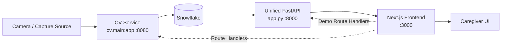
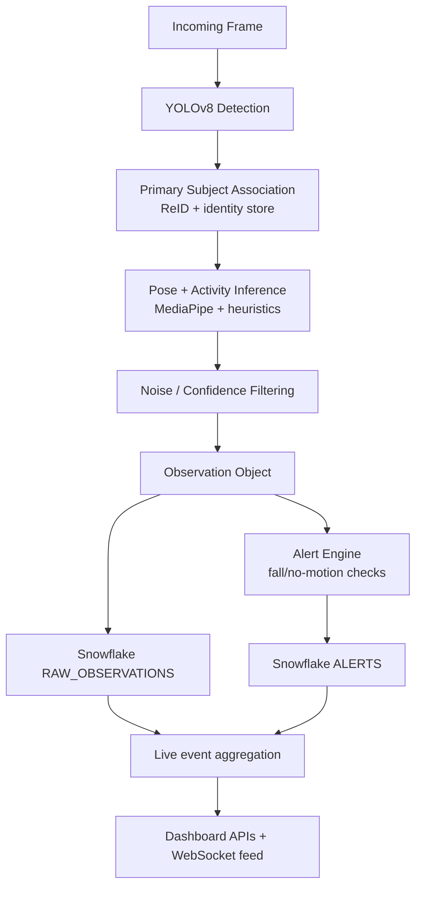
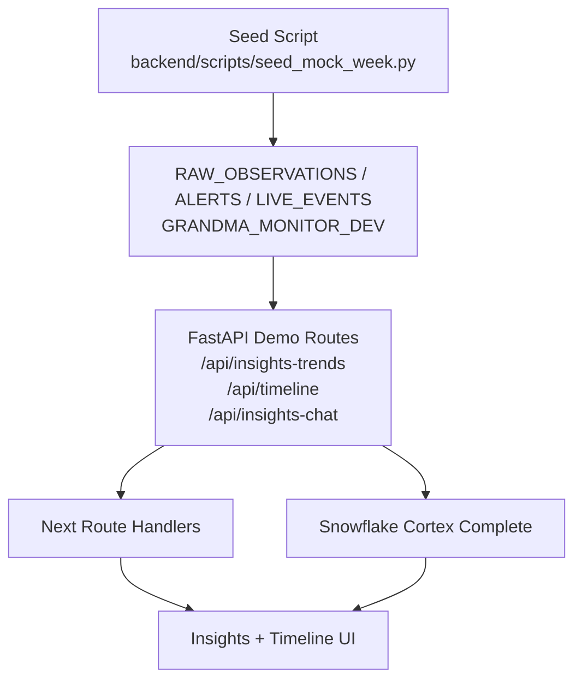

# ElderWatch (Hack USF 2026)

ElderWatch is an elderly-monitoring platform that combines computer vision, event pipelines, and a dashboard experience to help caregivers understand daily activity patterns, potential risk events, and trend summaries.

The system is designed to support both:
- **Live CV workflows** (camera -> inference -> event stream)
- **Demo analytics workflows** (Snowflake-backed seeded data -> insights + timeline + chat)

---

## High-Level Architecture



---

## In-Depth Pipelines

### 1) CV Observation Pipeline



**Models currently used:**
- **YOLOv8** (Ultralytics) for person/object detection
- **MediaPipe Pose Landmarker (BlazePose heavy)** for pose landmarks
- **OSNet ReID (torchreid)** for primary subject identity matching

### 2) Demo Insights Pipeline (Snowflake-backed)



**Safety model:**
- Demo-only analytics/chat routes are guarded to **dev DB targets** (`*_DEV`, especially `GRANDMA_MONITOR_DEV`)
- Production defaults remain unchanged

---

## Repository Structure

| Directory | Purpose |
|---|---|
| `frontend/` | Next.js 16 dashboard app (port 3000) |
| `backend/` | FastAPI routers, Snowflake access, demo analytics APIs |
| `cv/` | CV inference service, models/pipeline, enrollment, identity tracking |
| `capture/` | Capture scripts, RunPod/SSH helpers |
| `scripts/` | Dev run helpers (including demo runner) |
| `infra/` | Deployment/infra utilities |
| `shared/` | Shared types/contracts |

---

## Prerequisites

- Python 3.11+ (3.13 works for this repo)
- Node.js 20+
- npm
- Snowflake account + credentials (for DB-backed features)

Optional:
- GPU/RunPod for higher-throughput CV inference

---

## Quick Start (Demo Analytics + Chat)

This is the fastest way to run the dashboard with seeded mock data and AI analysis.

### 1) Install dependencies

From repo root:

```bash
python3 -m venv .venv
source .venv/bin/activate   # Windows: .venv\Scripts\activate
pip install --upgrade pip
pip install -r backend/requirements.txt

cd frontend
npm install
cd ..
```

### 2) Configure environment

Create root `.env` (or export vars) with at least:

```bash
SNOWFLAKE_ACCOUNT=...
SNOWFLAKE_USER=...
SNOWFLAKE_PASSWORD=...
SNOWFLAKE_WAREHOUSE=COMPUTE_WH
SNOWFLAKE_DATABASE=GRANDMA_MONITOR_DEV
SNOWFLAKE_SCHEMA=PUBLIC
# Optional model override for insights chat:
SNOWFLAKE_CORTEX_MODEL=mistral-large
```

### 3) Seed demo data

```bash
SNOWFLAKE_DATABASE=GRANDMA_MONITOR_DEV .venv/bin/python -m backend.scripts.seed_mock_week --include-grandpa --days 7
```

### 4) Run demo stack

```bash
./scripts/run_frontend_snowflake_demo.sh
```

Then open:
- `http://localhost:3000/demo` (sets demo session mode)

---

## Run Modes

### A) Frontend only (UI development)

```bash
cd frontend
npm run dev
```

### B) Unified backend (port 8000)

```bash
source .venv/bin/activate
uvicorn app:app --host 0.0.0.0 --port 8000
```

Useful routes:
- `GET /health`
- `GET /api/live-events`
- `GET /api/primary-state`
- `GET /api/insights-trends`
- `GET /api/timeline`
- `POST /api/insights-chat`
- `WS /ws/live`

### C) CV service only (port 8080)

```bash
source .venv/bin/activate
pip install -r cv/requirements.txt
uvicorn cv.main:app --host 0.0.0.0 --port 8080
```

---

## Remote GPU / RunPod Notes

If CV runs remotely, keep local frontend behavior by tunneling remote `8080` to local `8080`.

### One-shot tunnel

```bash
ssh -N -L 8080:127.0.0.1:8080 -p RUNPOD_PORT RUNPOD_SSH_USER@RUNPOD_IP
```

### Persistent tunnel helper

```bash
brew install autossh
./capture/autossh_setup.sh
```

### CUDA 12.8 lockstep install (RunPod)

```bash
python3 -m venv .venv
source .venv/bin/activate
pip install --upgrade pip
pip install -r cv/requirements-cuda128.lockstep.txt
bash cv/scripts/verify_runpod_gpu.sh
```

---

## Demo/Production Safety Rules

- Demo analytics APIs are **dev DB guarded** and reject production DB names by default.
- `scripts/run_frontend_snowflake_demo.sh` forces `SNOWFLAKE_DATABASE=GRANDMA_MONITOR_DEV` for its backend process.
- Keep normal production/deployment docs under `backend/snowflake/` unchanged for operational flows.

---

## Testing

### CV tests

```bash
source .venv/bin/activate
pip install -r cv/requirements-dev.txt
cd cv
python -m pytest
```

### Frontend checks

```bash
cd frontend
npm run lint
npm run build
```

---

## Troubleshooting

- **`ModuleNotFoundError: snowflake`**  
  Use the repo venv and install backend requirements:
  `source .venv/bin/activate && pip install -r backend/requirements.txt`

- **`Missing optional dependency: pandas` from Snowflake connector**  
  Install extras + pyarrow:
  `pip install "snowflake-connector-python[pandas]" pyarrow`

- **Demo pages show unavailable**  
  Open `/demo` first to enable demo session mode.

- **Cortex chat errors**  
  Verify role permissions for `SNOWFLAKE.CORTEX.COMPLETE` and model availability (`SNOWFLAKE_CORTEX_MODEL`).

---

## License

See `LICENSE.md`.
